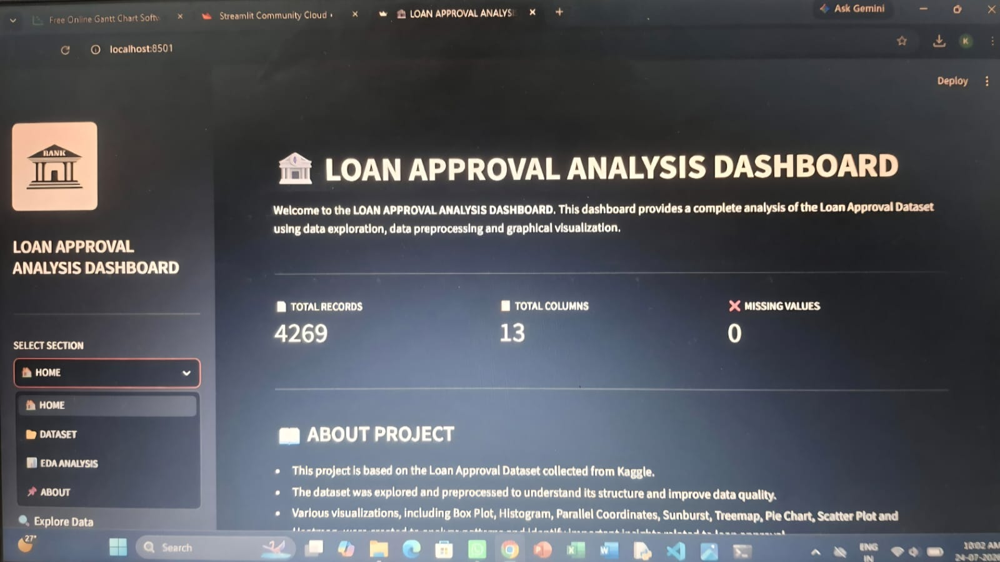

# 🏦 LOAN APPROVAL ANALYSIS PROJECT
## 📌 PROJECT OVERVIEW
This project analysis a loan approval dataset to understand the factors that affect loan approval decisions. The project includes data exploration, data cleaning and interactive visualizations created using Python and Streamlit.
---
## 🎯 PROJECT OBJECTIVE
The main objectives of this project are:
- Analysis loan applicant data.
- Identify factors affecting loan approval.
- Visualize important patterns using interactive charts.
- Provide meaningful insights from the dataset.
---
## 📂 DATASET
- **Dataset Name:** LOAN APPROVAL DATASET
- **SOURCE:** Kaggle
- **ROWS:** 4269
- **FEATURES:** 13 Columns including income, loan amount, education, CIBIL score, assets and loan status.
---
## 🛠️ TECHNOLOGIES USED 
- Python
- Pandas
- NumPy
- Plotly
- Matplotlib
- Seaborn
- Jupyter Notebook
- GitHub
---
## 🔄️ PROJECT WORKFLOW
- 📥 Load the dataset
- 🧹 Clean and preprocess the data
- 🔍 Explore the dataset
- 📊 Create interactive visuaizations
- 🔍 Analyze important patterns
- 🖥️ Display results using Streamlit
---
## 📋 DATASET COLUMNS
The dataset contains the following features:
- Loan ID
- Number of Dependents
- Education
- Self Employed
- Annual Income
- Loan Amount
- Loan Term
- CIBIL Score
- Residential Assets Value
- Commercial Assets Value
- Luxury Assets Value
- Bank Assets Value
- Loan Status
---
## 📊 PROJECT FEATURES
- Data Loading
- Data Exploration
- Data Cleaning
- Interactive Dashboard
- Loan Status Analysis
- Income Analysis
- Loan Amount Analysis
- CIBIL Score Analysis 
- Education Analysis
- Asset Analysis
- Correlation Heatmap
- Interactive Graphs
---
## 📈 VISUALIZATIONS
The dashboard includes:
- Box Plot
- Histogram
- Parallel Coordinates Graph
- Sunburst Graph
- Treemap
- Pie Chart
- Scatter Graph
- Correlation Heatmap
---
## 📚 PYTHON LIBRARIES
- Pandas
- NumPy
- Plotly
- Matplotlib
- Seaborn
- Streamlit
---
## 💡 KEY INSIGHTS
- Applicants with higher CIBIL scores are more likely to receive loan approval.
- Higher income generally increases the chances of loan approval.
- Education and assets also influence loan approval decisions.
- Interactive visualizations make the data easier to understand.
---
## 🎓 LEARNING OUTCOMES
Through this project, I learned:
- Data exploration, cleaning and preprocessing
- Data visualization using Plotly, Matplotlib and Seaborn
- Building dashboards with Streamlit
- Working with real-world datasets
- Using GitHub for project management
---
## 🚀 FUTURE IMPROVEMENTS
- Add more interactive filters.
- Improve dashboard design.
- Include additional visualizations.
- Add loan prediction using Machine Learning.
- Deploy the application online.
---
## ▶️ HOW TO RUN THE PROJECT
### 1. Clone the repository
'''bash
git clone
https://github.com/kamaljitkaur3019-creator/loan_approval_prediction_project.git
'''
### 2. Install the required libraries
'''bash
pip install -r requirements.txt
'''
### 3. Run the Streamlit application
'''bash
streamlit run loan_app.py
'''
---
## 📁 PROJECT FILES
- 'loan_app.py' - Streamlit application
- 'loan_approval_dataset.csv' - Dataset
- 'requirements.txt' - Required libraries
- 'README.md' - Project documentation
---
## 📷 DASHBOARD PREVIEW

---
## 📌 CONCLUSION
This project demonstrates how data analysis and interactive visualizations can help understand the factors affecting loan approval. The dashboard provides clear insights into applicant information and loan approval trends.
---
## 👩‍💻 AUTHOR
**KAMALJIT KAUR**
B.Tech Computer Science Engineering Student
---
## ⭐ THANK YOU
Thank you for visiting this project. I hope you find this project helpful and informative.
---